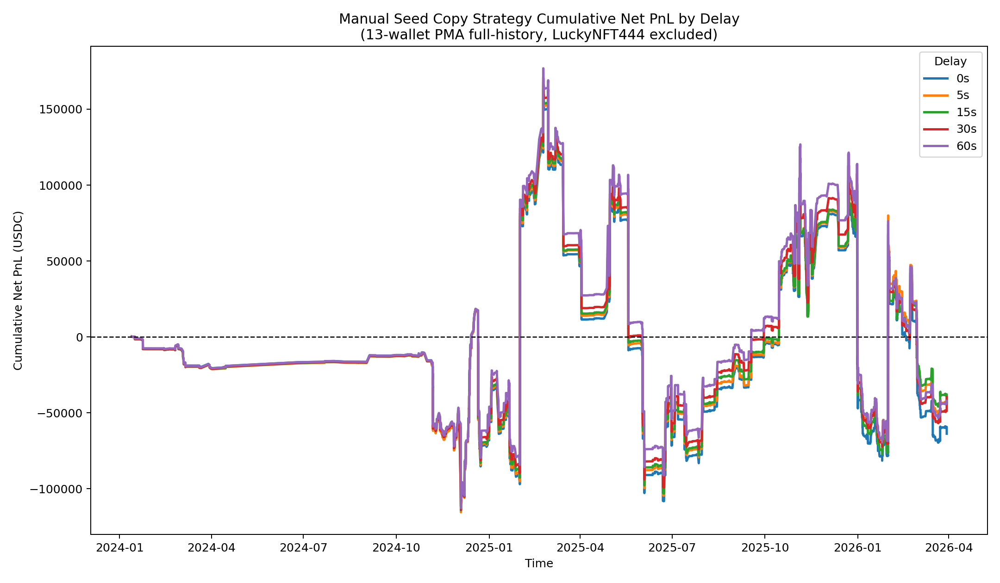

# Research Note: Copy-Trading a Curated Basket of Polymarket Wallets

## Abstract
This note evaluates a discretionary copy-trading strategy built from a hand-selected basket of Polymarket wallets that appeared, on external analytics and manual review, to be consistently profitable, active, and stylistically non-random. The implementation here is deliberately conservative: trades are copied only after a delay, public prices are used for execution, fees are charged, and open copied positions are marked to market using current public prices. The key empirical result is negative: as a pooled strategy, the basket does **not** survive implementation friction. However, the cross-sectional results are heterogeneous, which suggests that wallet selection and execution quality matter more than raw wallet profitability.

## Strategy Definition
The strategy tested here is:

1. Start from a manually curated list of 13 wallets, after excluding `LuckyNFT444` because its PMA trade tape is exceptionally large and operationally distortive.
2. Use Polymarket Analytics `activity-trades` as the signal source.
3. Map each wallet trade to a public Gamma market and CLOB token.
4. Copy wallet **BUY** trades at one of five implementation delays: `0s`, `5s`, `15s`, `30s`, `60s`.
5. If the source wallet later sells the same token, exit the copied position after the same delay.
6. If the copied position remains open, mark it to market using the latest public price snapshot.
7. Subtract modeled costs, including fees and execution friction.

This is therefore a **copyability** test, not a test of whether the source wallets themselves are profitable.

## Data and Measurement
- Seed wallets requested: `13`
- Wallets with mapped public-market backtest output: `10`
- Full-history mapped trades used: `53133`
- Copy slices built: `52085`
- Analysis timestamp: `2026-03-30T01:02:30.682798+00:00`

Three wallets did not produce mapped backtest output in this run because their PMA trades did not resolve to public Gamma event/token mappings under the current public mapping layer:
- `Gambler1968`
- `Kickstand7`
- `ppp22232`

A material limitation remains: `0x53_candidate` appears truncated in this specific PMA pull. Its current cached PMA history begins in `2025-06`, whereas an earlier PMA pull had a longer visible history. Its results should therefore be interpreted conservatively.

## Portfolio-Level Results
Combined net PnL for the 13-wallet basket, after excluding `LuckyNFT444`, is:

- `0s`: `-63763.36 USDC`
- `5s`: `-44209.84 USDC`
- `15s`: `-43238.15 USDC`
- `30s`: `-39544.52 USDC`
- `60s`: `-42106.16 USDC`

The sign is negative at every tested delay. That means the basket, as an investable pooled strategy, is not robust enough to recommend in current form.

## Real PnL Curve

The figure plots cumulative net PnL over time, using realized copied exits when the source wallet sells and final mark-to-market treatment for copied positions still open at the analysis timestamp.

## Cross-Sectional Findings
### Wallets with the strongest `30s` copy performance
- `0x53_candidate` `0x53ecc53e7a69aad0e6dda60264cc2e363092df91`: copy PnL at `30s` = `32953.89 USDC`, wallet own PMA gain = `219405.22 USD`
- `sbinnala` `0xc483ee2ce773ae281131382ecc6285c968b88ac8`: copy PnL at `30s` = `16371.91 USDC`, wallet own PMA gain = `18829.33 USD`
- `SnowballHustle` `0xe36296a42555b95e95880412387e954d84b0bd00`: copy PnL at `30s` = `15644.37 USDC`, wallet own PMA gain = `18672.39 USD`
- `MikeMoore` `0x5d2f49295387e01a49f0a3e59449ceed791c4adb`: copy PnL at `30s` = `15236.55 USDC`, wallet own PMA gain = `17209.01 USD`
- `PetrGrepl` `0xe7590338d435112c032e3ea51ff3d08a27a1e7ca`: copy PnL at `30s` = `5820.77 USDC`, wallet own PMA gain = `17250.78 USD`
- `ELICHOU` `0x312bcca3bc77bdc1d37dc6db5b9c1493de61cafe`: copy PnL at `30s` = `3381.78 USDC`, wallet own PMA gain = `16489.48 USD`
- `aikko` `0x68d1b156197fc516c56fc95d325b3716322c3c4d`: copy PnL at `30s` = `2656.92 USDC`, wallet own PMA gain = `17663.16 USD`
- `RobertoRubio` `0x3c4c03892f47d3166ee049a48a73d4743a17dd95`: copy PnL at `30s` = `1282.98 USDC`, wallet own PMA gain = `18135.63 USD`

### Wallets with the weakest `30s` copy performance
- `0x77_candidate` `0x77fd7aec1952ea7d042a6eec83bc4782f67db6c8`: copy PnL at `30s` = `-4701.40 USDC`, wallet own PMA gain = `10338.58 USD`
- `Melody626` `0xecaa8806a9a05049d7d5260a33dc924220e377a9`: copy PnL at `30s` = `-128192.28 USDC`, wallet own PMA gain = `394453.90 USD`

## Why the Strategy Works in Part
The positive subgroup is informative. Several wallets remain profitable for a follower even after a delay and cost model, including `0x53_candidate`, `sbinnala`, `SnowballHustle`, `MikeMoore`, and `PetrGrepl`. This implies that some wallets are not merely lucky ex post; they appear to trade in a way that leaves residual edge for a slower observer.

The most encouraging pattern is not “every profitable wallet is copyable,” but rather “a small subset of profitable wallets remains copyable after friction.” That is economically meaningful.

## Why the Strategy Fails as a Pooled Product
The pooled basket fails for three reasons.

### 1. Source-wallet alpha is not the same as follower alpha
A wallet may be highly profitable on PMA and still be a poor copy target. `Melody626` is the clearest example: the wallet’s own PMA gain is strongly positive, yet the copy-trader’s full-history net result is deeply negative. The investor implication is straightforward: wallet profitability and copyability must be treated as separate variables.

### 2. Execution quality dominates outcomes
Even the `0s` line is not a literal replication of the source wallet’s fills. It is the earliest modeled public-price implementation. That means the follower still loses queue priority, maker advantage, and trade-specific microstructure edge. For high-frequency or very active wallets, these small frictions accumulate dramatically.

### 3. Concentration risk is severe
The basket is not diversified in the economically relevant sense. A single weak but hyperactive wallet can overwhelm several smaller positive wallets. In this run, the most negative contributor is so large that it swamps much of the positive cross-section.

## Problems and Identification Risks
- PMA deep pagination is unstable for very heavy traders. `LuckyNFT444` was therefore excluded from this run, and `0x53_candidate` may still be partially truncated.
- Three seed wallets were not backtestable under the current public PMA->Gamma mapping layer.
- Public prices are used as an execution proxy. Even the `0s` case is therefore not the source wallet’s true execution.
- Maker/taker identity is not directly observable for third-party wallets. Maker fills are conservatively approximated.
- This study copies wallet `BUY` signals and uses later wallet `SELL` signals as exits. It does not reproduce every possible hedge, cross-market adjustment, or inventory-management tactic used by the underlying wallet.

## Overall Evaluation
My evaluation is **negative on the basket, positive on the research direction**.

As a product one could allocate to immediately, this strategy is not ready. The full pooled basket loses money after implementation. For an investor, that is the decisive result.

As a research program, however, the result is encouraging. The distribution is not uniformly bad. Several wallets remain positive after friction, while others are clearly uncopiable. That means the relevant problem is one of **selection**, not of total absence of signal.

## Recommendation to an Investor
I would not recommend deploying capital into the equal-weighted or indiscriminate 13-wallet copy basket.

I would recommend the following instead:
- Treat this as a screening framework rather than a finished trading strategy.
- Focus only on the wallets that remain positive after delay and cost modeling.
- Exclude wallets whose own PMA profitability does not survive follower execution.
- Audit highly active wallets separately, because they can dominate portfolio-level PnL.
- Resolve mapping and historical coverage issues before drawing hard conclusions on excluded or partially truncated names.

## Bottom Line
The evidence does **not** support the claim that “copying profitable wallets” is itself a profitable strategy.

The evidence **does** support a narrower and more interesting claim: a small subset of profitable wallets appears to leave copyable edge after realistic friction, but the basket must be filtered aggressively and monitored continuously.
